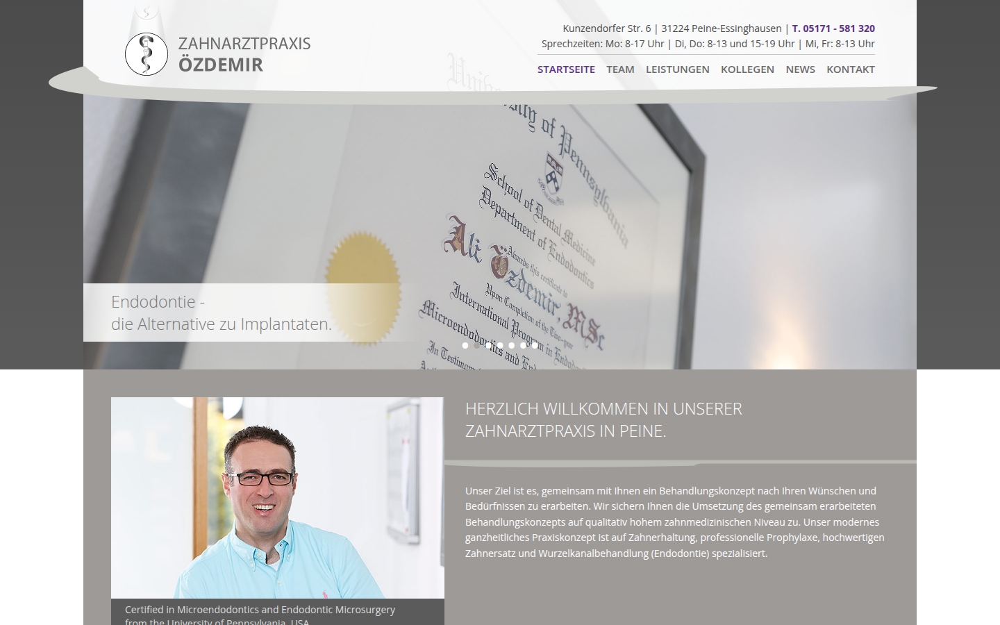
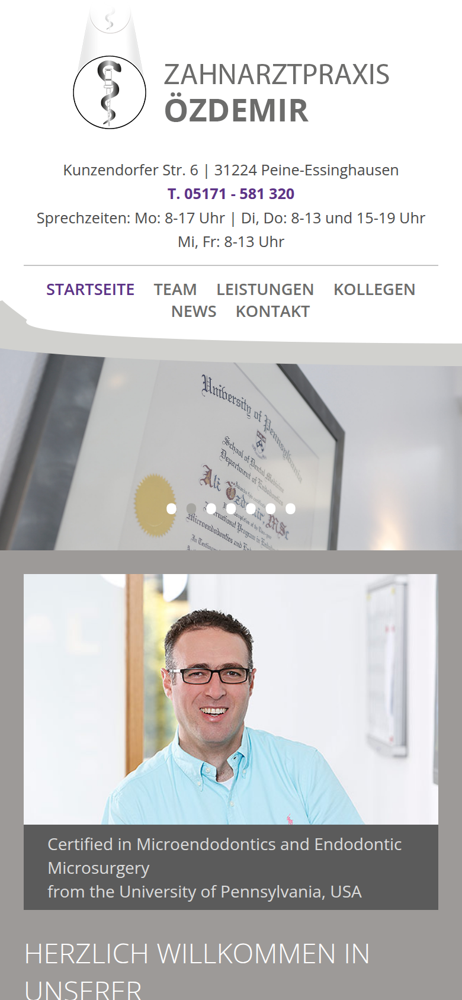
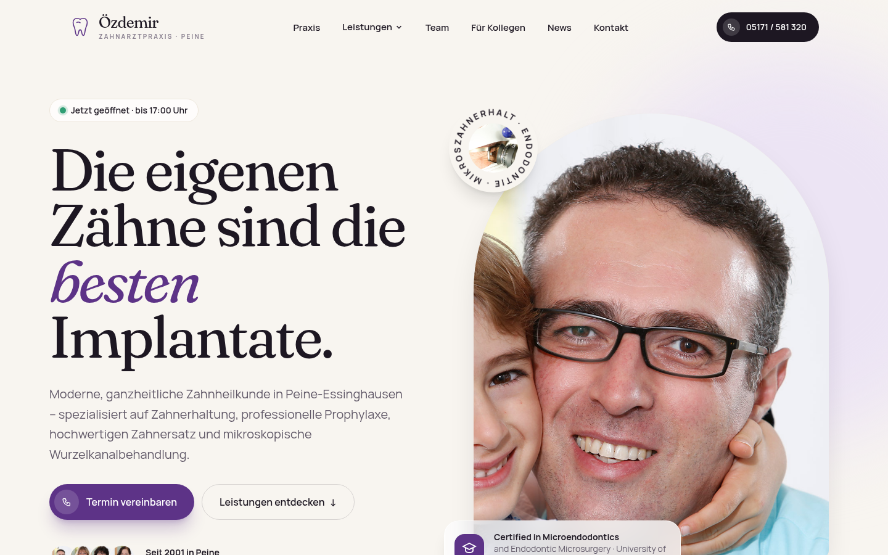
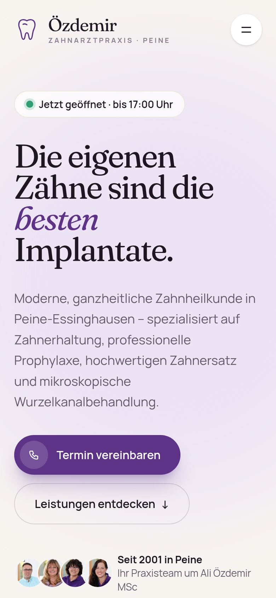

# alioezdemir

**oezdemir-die-praxis.de** (Zahnarztpraxis Özdemir, Peine) için iki Next.js sürümü. Eski site Contao ile çalışıyordu; içerik Contao veritabanından `content/site.json`'a çıkarıldı, iki sürüm de bu aynı içeriği statik site olarak üretir.

## ▶ Demo

**https://billylz.github.io/alioezdemir/**

| | Sürüm | Demo |
| --- | --- | --- |
| **web_alt** | Eski Contao görünümünün birebir kopyası | **https://billylz.github.io/alioezdemir/web_alt/** |
| **web_dev** | Yeni, mobil öncelikli tasarım | **https://billylz.github.io/alioezdemir/web_dev/** |

### web_alt — eski görünüm

<p>
  
  
</p>

2016–2022 arasındaki Contao sitesinin görünümü: kavisli başlık, slider, üst menü, gri sütunlar. Başlık, slider, kenar çubuğu, hızlı menü ve sütunlar eski temanın `master.less` dosyasına göre yapıldı. Eski Google Analytics için olan çerez banner'ı bilerek alınmadı.

### web_dev — yeni tasarım

<p>
  
  
</p>

Aynı içerik, yeni tasarım: canlı **açık / kapalı** durumu (`OpenStatus`), çalışma saatleri tablosu (`HoursTable`), Google Maps yalnızca onaydan sonra yüklenir (`MapConsent`), mobil menü, galeri.

## Klasörler

| Klasör | İçerik |
| --- | --- |
| `web_alt/` | Next.js 16, eski görünüm (`src/app/[[...slug]]`, `SiteChrome`, `Slider`, `Elements`) |
| `web_dev/` | Next.js 16, yeni tasarım (`src/app/[...slug]`, `src/lib/praxis.ts` sabit veri) |
| `*/content/site.json` | Contao'dan çıkarılan 27 sayfa (sayfa ağacı, makaleler, içerik elemanları, formlar) |
| `*/public/files/` | Contao `files/` klasöründeki görseller ve PDF'ler |
| `data/site_2016` … `site_2022` | Sitenin Wayback Machine'den indirilmiş yıllık kopyaları (görünüm referansı) |
| `wayback_indir.py` | Bu yıllık kopyaları indiren script |
| `pages/index.html` | GitHub Pages giriş sayfası |
| `scripts/pages-rewrite.mjs` | Statik çıktıyı `/alioezdemir/...` alt yolunda çalışır hale getirir |

## Geliştirme

```bash
cd web_dev          # ya da web_alt
npm install
npm run dev         # http://localhost:3000
npm run build       # out/ — statik site (team.html, leistungen/bleaching.html …)
```

URL'ler eski Contao sitesiyle aynıdır (`/team`, `/leistungen/prophylaxe` …), böylece eski linkler çalışmaya devam eder.

### İçeriği Contao'dan yeniden çıkarmak

`scripts/export-contao.mjs` Contao veritabanını okuyup `content/site.json` üretir ve kullanılan dosyaları Contao kurulumunun `files/` klasöründen `public/files/`'a kopyalar. Bağlantı bilgileri ortam değişkenlerinden okunur:

```bash
DB_HOST=… DB_USER=… DB_PASS=… DB_NAME=… FILES_ROOT=<contao-kurulumu> node scripts/export-contao.mjs
```

Ham Contao yedekleri (SQL dump'lar, kurulum dosyaları) `data/old/` altındadır ve şifre içerdikleri için **repoda yoktur** (`.gitignore`).

### Wayback kopyaları

```bash
python3 wayback_indir.py              # 2016..2022 hepsi
python3 wayback_indir.py --yil 2018   # sadece bir yıl
```

İnen dosyalar `data/_cache/`'te tutulur, yarıda kesilirse kaldığı yerden devam eder. Arşivde bulunamayanlar her yılın `_eksik.txt` dosyasında listelenir.

## GitHub Pages

`main`'e her push'ta `.github/workflows/pages.yml` iki siteyi `BASE_PATH=/alioezdemir/web_alt` ve `/alioezdemir/web_dev` ile build eder, `scripts/pages-rewrite.mjs` ile `/files/…` gibi kökten başlayan yolları alt yola çevirir ve giriş sayfasıyla birlikte yayınlar. `BASE_PATH` verilmezse build normal (kök) çalışır.
